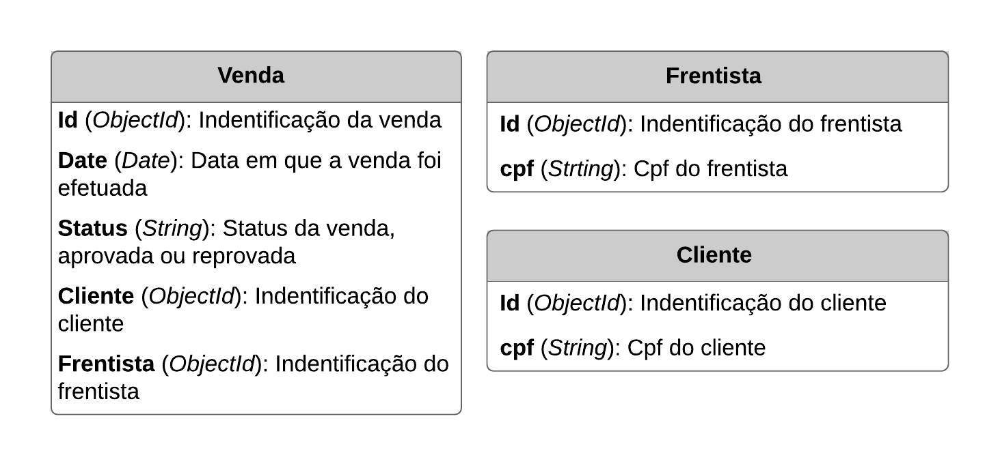

# Documentação - Sistema Antifraude

## Objetivo

Construção de um servidor que receba informações de uma venda e, se baseando em determinadas regras de negócio, identifique essa venda como fraudulenta ou não. A arquitetura recebe vendas em um sistema de mensageria, que assim é enviado a mesma informação para diversos lugares.

## Regras de Negócio

**Importante:** qualquer venda que extrapola as regras de negócio ao olhar para as vendas no banco de dados deve ser considerada como fraudulenta.

1. O mesmo frentista pode vender no máximo 20 abastecimentos no mês;

2. Um único frentista pode vender no máximo 20% de todas as vendas;

3. Um único cliente pode abastecer seu carro no máximo 7 vezes por mês;

4. Um frentista pode vender no máximo 3 vezes para o mesmo cliente.

## Banco

**Dados:** Os dados estão estruturados em três entidades:



**Banco de Dados:** Para o projeto foi utilizado o um banco NoSql, o MongoDb.

### Por que a escolha de um bando NoSql?

A escolha pelo MongoDb se deu devido a algumas características do projeto. O projeto em questão não apresenta relações entre as tabelas complexas, essa característica favorece o banco NoSql. Com a baixa complexidade de relações entre tabelas o MongoDb consegue entregar o dados solicitado com muita eficiência e agilidade.

Pensando em agilidade, essa é uma das características mais fortes de um banco NoSql. O projeto pode de aproveitar dessa característica, pois pressupõe-se que haverá um grande o número de consultas simultâneas em um sistema de validação de fraude.

A característica de não ser um banco esquemático possibilita que futuramente sejam adicionadas novas informações ao banco sem prejudicar os dados previamente inseridos.

### Você consegue prever algum gargalo em algum comportamento específico da sua aplicação?

Um possível gargalo que pode acontecer está presente na validação da venda.

Caso seja efetuada solicitações de vendas simultâneas pode ser que aconteça de uma venda ser validada quando não deveria.

Esse comportamento ocorre, pois o código possui o seguinte fluxo de operação:

1. É feita a requisição;
2. É realizada a consulta dos dados do cliente e do frentista com base no seu cpf;
3. São verificadas as regras de negócio;
4. O dado é lançado no banco.

Se a etapa 3 ocorrer em paralelo a outros processos que estejam verificando o mesmo cliente ou frentista pode ser que aconteça de uma venda ser validada quando não deveria. Vale destacar que um comportamento como esse é muito improvável de acontecer e as solicitações teriam que estar muito sincronizadas devido à velocidade do processo.

## Documentação do Código

##### Instalar módulos do Node

`$ npm install`

##### Inicializa o servidor

`$ npm start`

O servido será inicializado no endereço http://localhost:3030.

Para realizar a verificação da venda o _client_ deve enviar um evento com o nome "**newSale**" e deve enviar os dados na seguinte estrutura:

```js
{
  valor: (Number)/* Valor da compra */,
  frentista: (String)/* Cpf do frentista */,
  cliente: (String)/* Cpf do cliente */,
  date: (Date)/* Data da compra */
}
```

A resposta à solicitação será enviada em um evento com o nome "**verifiedSale**".
Caso a solicitação seja aprovada a resposta seguirá a seguinte estrutura:

```js
{
  success: true /* Status se é válido ou não */;
  venda: {
    /* Objeto salvo */
  }
}
```

Se não for encontrado nenhum cliente ou frentista a resposta possuirá a seguinte estrutura:

```js
{
  success: false;
  error: "invalid fields" /* Erro encontrado */;
  dataSend: {
    /* Objeto enviado como entrada */
  }
}
```

Se a venda não é válida a resposta possuirá a seguinte estrutura:

```js
{
  success: false;
  errors:[{ /* Lista com os erros na validação */
    error: (Number)/* Código numérico do erro */
    msg: /* Mensagem descrevendo o erro */
  }],
  venda: {/* Objeto salvo */}
}
```

O objeto salvo no banco possui a seguinte estrutura:

```js
{
  _id: (ObejctId)/* Id do objeto salvo */,
  valor: (Number)/* Valor da compra */,
  date: (Date)/* Data da compra */,
  status: (String)/* Status se foi aprovado ou reprovado */,
  cliente: (ObjectId)/* Id do cliente */,
  frentista: (ObjectId)/* Id do frentista */
}
```

Caso a compra seja aprovada o status da venda é marcada como "aprovado" caso contrario é marcado como "reprovado".

## Perguntas

### O que você sabe sobre sistemas de mensageria? Cite exemplos de casos onde é uma boa opção utilizar ou não.

Um serviço de mensageria é um serviço que gerencia troca de requisições em tempo real.

Alguns exemplos de aplicações desse serviço temos:

- Serviços de colaboração de documentos
- Serviços de troca de mensagens instantâneas
- Serviços de análise em tempo real

Em linhas gerais em aplicações onde não há a necessidade de comunicação real time não é uma boa opção a sua utilização, como exemplo temos:

- Blogs
- Sites de notícias

### O que você entende sobre pipelines CI/CD?

A pipeline CI - Continuos Implementation, é responsável pela realização de testes contínuos, ou seja, conforme o desenvolvedor sobe uma nova atualização, seja no ambiente de desenvolvimento, ou no de produção, a rotina de teste é executada para verificar se a aplicação continua estável após a atualização.

A pipeline CD - Continuos Deployment, é responsável por subir o novo código para o servido após uma atualização bem sucedida.

## Ferramentas utilizadas para o projeto:

**BACKEND** - Node.Js

**BANCO DE DADOS** - MongoDB
